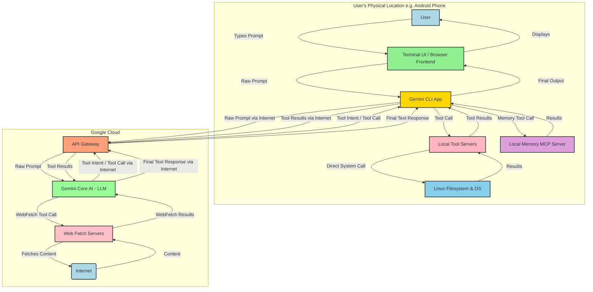

```mermaid
graph TD
    subgraph User_Physical_Location["User's Physical Location e.g. Android Phone"]
        A["User"] -->|Types Prompt| B["Terminal UI / Browser Frontend"]
        B -->|Raw Prompt| C["Gemini CLI App"]
        C -->|Tool Call| D["Local Tool Servers"]
        C -->|Memory Tool Call| E["Local Memory MCP Server"]
        D -->|Direct System Call| F["Linux Filesystem & OS"]
        F -->|Results| D
        E -->|Results| C
        D -->|Tool Results| C
        C -->|Final Output| B
        B -->|Displays| A
    end

    subgraph Google_Cloud["Google Cloud"]
        G["API Gateway"]
        H["Gemini Core AI - LLM"]
        H -->|WebFetch Tool Call| I["Web Fetch Servers"]
        I -->|Fetches Content| J(Internet)
        J -->|Content| I
        I -->|WebFetch Results| H
    end

    C -->|Raw Prompt via Internet| G
    G -->|Raw Prompt| H
    H -->|Tool Intent / Tool Call via Internet| G
    G -->|Tool Intent / Tool Call| C
    C -->|Tool Results via Internet| G
    G -->|Tool Results| H
    H -->|Final Text Response via Internet| G
    G -->|Final Text Response| C

    style A fill:#ADD8E6,stroke:#333,stroke-width:2px
    style B fill:#90EE90,stroke:#333,stroke-width:2px
    style C fill:#FFD700,stroke:#333,stroke-width:2px
    style D fill:#FFB6C1,stroke:#333,stroke-width:2px
    style E fill:#DDA0DD,stroke:#333,stroke-width:2px
    style F fill:#87CEEB,stroke:#333,stroke-width:2px
    style G fill:#FFA07A,stroke:#333,stroke-width:2px
    style H fill:#98FB98,stroke:#333,stroke-width:2px
    style I fill:#FFC0CB,stroke:#333,stroke-width:2px
    style J fill:#ADD8E6,stroke:#333,stroke-width:2px
```