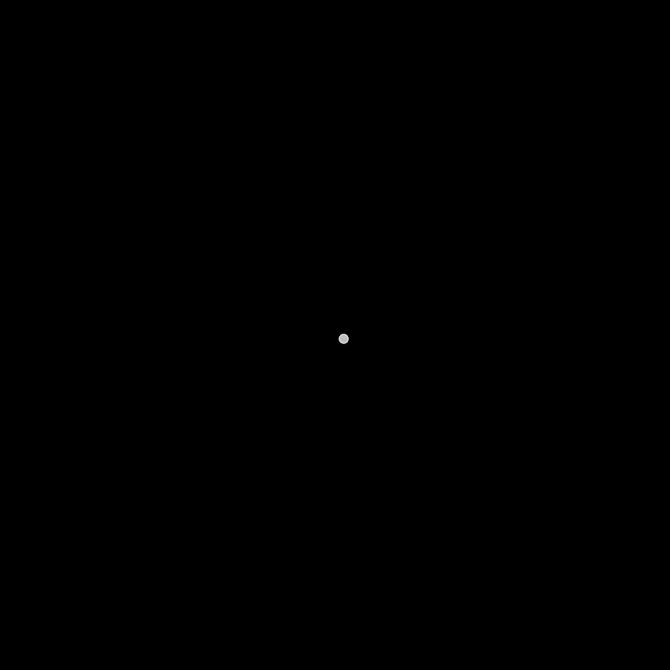

### Recreate the animation from description

Write Python code (preferably using matplotlib.animation or a similar library) that generates the following animated pattern:

**Overall appearance and feel** A hypnotic, clean geometric pinwheel or propeller on a solid black background. The animation consists only of discrete, sharp colored dots — no noise, no filler particles, no glow, no blur, no background elements. It evokes a mathematical optical toy or psychedelic mandala in 2D, with orderly symmetry and smooth motion.

**Sequence over time** (timing approximate, but the order and transitions are key):

1. **Initial phase (first few seconds)**: A single bright white dot sits exactly at the center. Nothing else is visible.
2. **Next phase**: Three equally spaced arms suddenly appear from the center and begin extending outward together. The arms are 120° apart and share the same length at every moment.
3. **Following phase**: Three more arms appear (now six total, 60° apart), instantly matching the current length of the existing arms. All six continue extending outward at the same rate.
4. **Final phase**: Six more arms appear (now twelve total, 30° apart), again instantly at the current full length. All twelve arms keep extending together.

From the moment the first arms appear onward, **the entire pattern rotates continuously** around the center at a calm, steady speed that feels hypnotic but not overwhelming.

**Arm and dot properties**

- Each arm is composed of a fixed number of dots arranged along a gentle, wide spiral path (not tight or galaxy-like).
- All visible arms are always the same length — when new arms appear, they pop in at the same extended length as the others (they do not start short or grow from the center).
- Dot size increases noticeably with distance from the center: small and dense near the middle, larger and more spaced-out toward the outer ends.
- No dots exist outside the spiral arms — the background remains pure black.
- Each arm has a single, vivid, saturated color. The twelve colors together cover a rainbow-like range (bright primaries and secondaries) without gradients along individual arms.
- Dots are round, with slight transparency so overlapping regions near the center appear richer but not muddy.

**Growth and looping**

- Arms extend outward until they nearly fill the visible frame (or just reach the edges).
- Once the pattern is fully extended (after the final arm addition), growth stops — only the steady rotation continues.
- The animation should loop smoothly forever without visible jumps or resets (the pure rotation phase enables this).

**Technical / aesthetic guidelines**

- Maintain a square aspect ratio and fixed view (no zooming or panning).
- No axes, grid, borders, or persistent title.
- The result should feel precise, geometric, and endlessly watchable — like a visual meditation aid or pattern-recognition test.

**Goal** Produce an animation that closely matches the perceptual flow: from a simple point to increasing symmetry, orderly outward growth, then endless hypnotic rotation — all with clean, discrete dots and no extraneous visual clutter.

