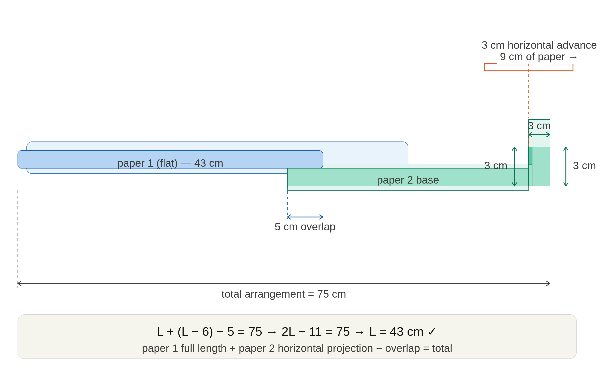

The key geometry is visible in the diagram: the fold consumes **9 cm of paper length** (front wall 3 + top 3 + back wall 3) but only advances **3 cm horizontally**. That 6 cm gap is the wasted length — hence paper 2 contributes only L−6 = 37 cm to the horizontal span, and the equation 2L−11 = 75 gives **L = 43 cm**.
