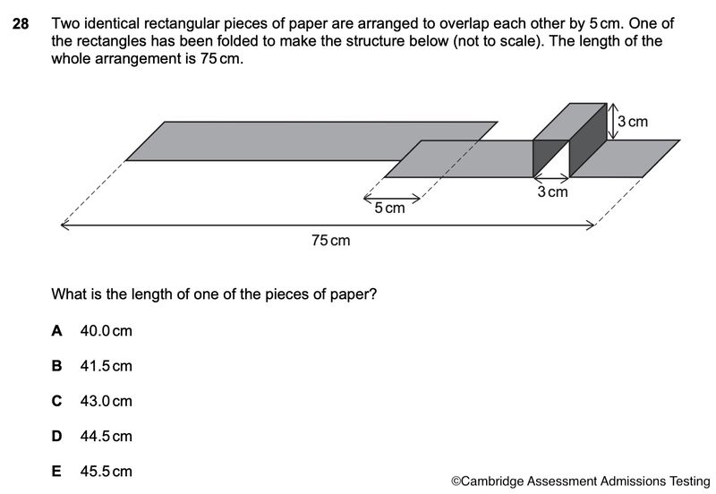

**ChatGPT is wrong.** The correct length is **43.0 cm**.

### Pure geometric reasoning from the diagram (no authority)

The diagram shows a **3D step structure** made by folding one rectangular strip:

- There is a **raised rectangular platform** that is 3 cm high and 3 cm wide (along the length direction).
- This creates **two vertical faces** (front and back of the step) and **one horizontal top face**.
- Labeled dimensions: vertical height = 3 cm, horizontal top of step = 3 cm.

The paper is a flat rectangle. When you fold it to form this step:

1. A segment of paper **3 cm long** is folded upward → becomes the **first vertical wall** (contributes 0 cm horizontally).
2. The next segment **3 cm long** lies flat on top → becomes the **top platform** (contributes 3 cm horizontally).
3. The following segment **3 cm long** is folded downward → becomes the **second vertical wall** (contributes 0 cm horizontally).
4. Then it continues flat again.

**Paper length consumed in the fold: 3 + 3 + 3 = 9 cm.**  
**Horizontal advance from the fold: only 3 cm.**

Thus, the folded piece contributes **6 cm less** to the overall horizontal length than if it were flat.

### Equations

Let \( L \) = length of each identical piece.

- Flat piece contributes: \( L \)
- Folded piece contributes: \( L - 6 \)
- Overlap: −5 cm

Total arrangement:  
\[ L + (L - 6) - 5 = 75 \]  
\[ 2L - 11 = 75 \]  
\[ 2L = 86 \]  
\[ L = 43 \] cm

### Why ChatGPT's 41.5 cm reasoning fails

It only accounts for **one** vertical leg + the top (6 cm paper → 3 cm horizontal, net shortening of 3 cm). It completely ignores the **second downward vertical leg** visible in the diagram (the back wall of the raised block).

The "width of the paper is 3 cm" argument is misleading. The 3 cm labels refer to the **dimensions along the folding direction** (the length of the strip), not just the transverse width being rotated. The paper's length is what gets divided into these three 3 cm segments to create the 3D shape.

If it were only a single rise without the full step down (like a ramp or half-fold), the shortening would be 3 cm and 41.5 cm would work. But the diagram shows a **full rectangular prism/step** with two vertical sides. That requires the full 9 cm of paper for 3 cm of horizontal progress. 

This is determined directly from counting the faces in the given structure.
